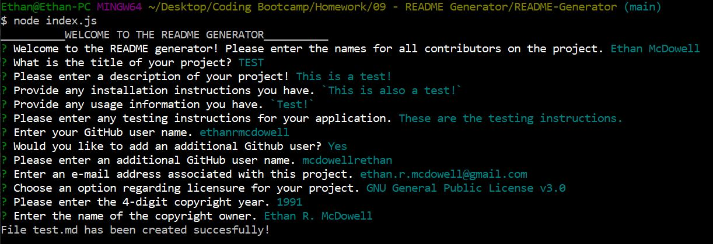
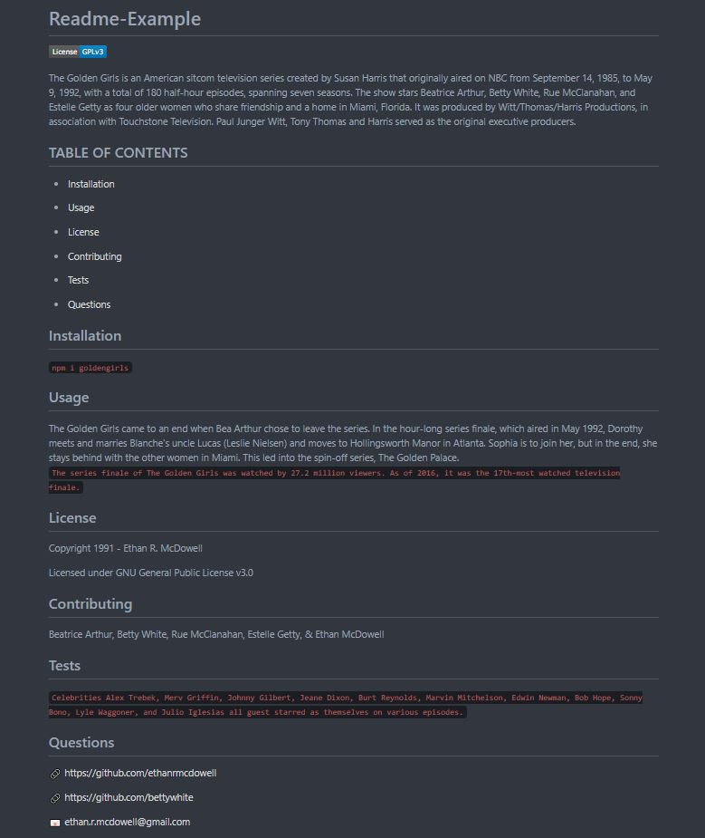

  # **README Generator**

  This application will generate a README for your project based on prompts in the command line. Using Node.js, you can launch the index.js file which will proceed to ask multiple questions which, upon completion, will populate a README file for.
  
  :link: [Video Demo](https://youtu.be/Wjkx-ff0JAg)

  ## TABLE OF CONTENTS
  
  - [Features](#Features) 

  - [Images](#Images)

  - [License](#License) 

  - [Contributing](#Contributing) 

  - [Tests](#Tests) 

  - [Questions](#Questions) 

  
  ## Features
  - Uses inquirer.js to prompt user for information on project.
  - Utilizes inquirer 'when' statements in order to get more information based on your responses.
    - Example: if you enter 'other' into the licensing section, it will prompt you for the name of your license. If you enter 'None' it will skip that question as well as the questions asking for the year and name of copyright holder.
  - Allows you to enter an additional GitHub link to the README in case there's more than one person working on your project.
  - Provides working table of contents which will link you to each section of the readme.
  
  ## Images

  
  

  ## License
  
 Copyright 2020 Ethan McDowell
  

  ## Contributing
  
 Ethan R. McDowell. This project was completed as part of MSU's full-stack web development bootcamp.
  

  ## Questions
  
 :link: <a href='https://github.com/ethanrmcdowell'>ethanrmcdowell</a>
  
  
 :e-mail: ethan.r.mcdowell@gmail.com

